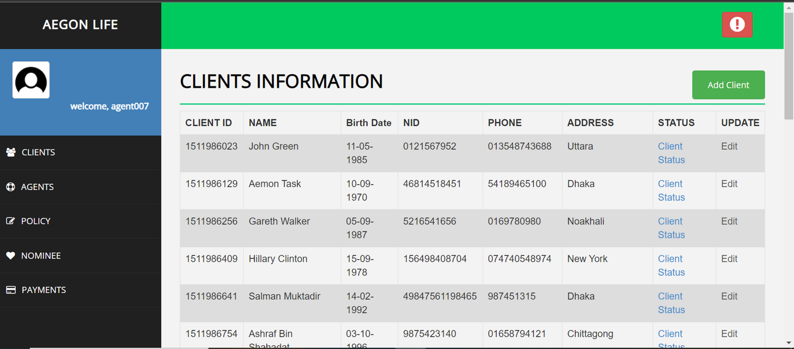

# Life Insurance Management System

A dashboard website for a Life Insurance Company. Built using PHP, MySQL, HTML, and CSS.

## Features

- **Login/Logout**: Secure authentication with session management.
- **Multilevel Access**: Different roles for agents and master agents.
- **Image Uploads**: Agents can upload images for client records.
- **Client Management**: 
  - Agents can create clients.
  - Agents can only edit and delete info of the clients they created.
  - Master Agent can create, update, and delete all clients and agents' info.
- **Payment Management**: Payment records and nominees can be added and managed by agents.

## Deployment on Localhost

Assuming XAMPP is already installed on your local machine:

1. **Clone the repository**:
    ```sh
    git clone <repository-url> xampp/htdocs/lims
    ```

2. **Configure Database Connection**:
    - Edit the `lims/connection.php` file with your database username and password.

3. **Setup the Database**:
    - Go to [http://localhost/phpmyadmin](http://localhost/phpmyadmin).
    - Create a database named `lims`.
    - Import the `lims.sql` file provided in the `database_backup` folder.

4. **Access the Application**:
    - Open [http://localhost](http://localhost) in your browser.
    - If you see a login page, the setup is working correctly.
    - Use the following credentials to log in:
        - **Username**: `agent007`
        - **Password**: `220150024`

## SQL Queries for Data Manipulation

Client info and payment info can be copied and manipulated using SQL queries, similar to the ones used in other projects.

## Images

### ER Diagram


### Client Info


### Client Management


### Dashboard


### Login Page


### Payment Management


### Database Tables

